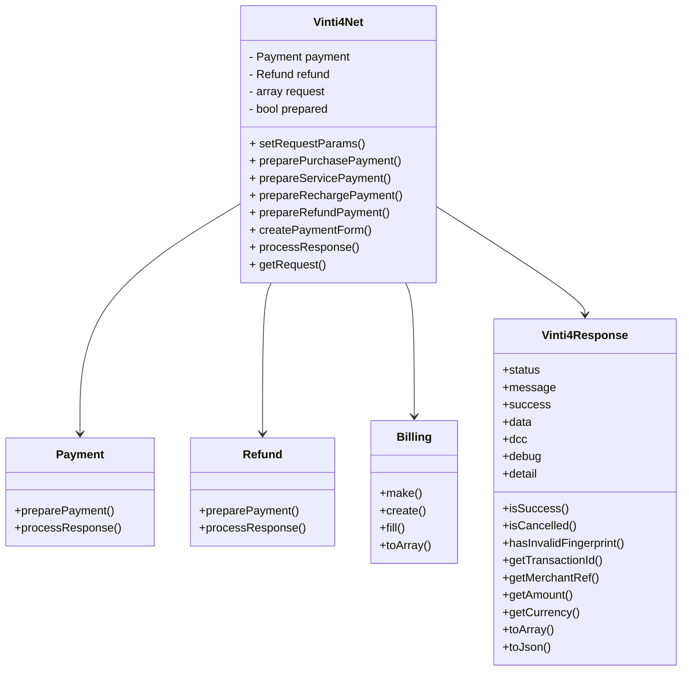
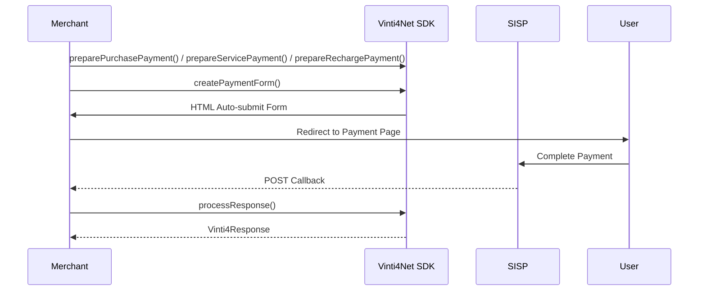
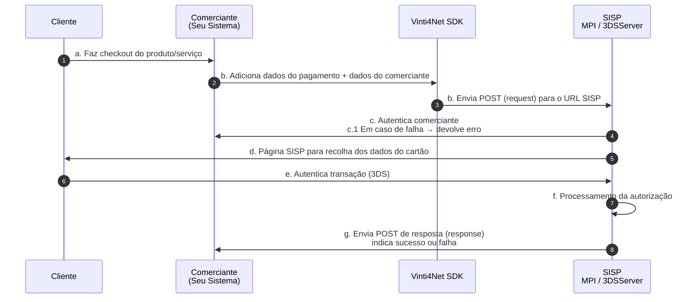

# 🏗️ SDK Architecture Overview

O diagrama abaixo apresenta **as classes principais do SDK** e suas dependências:

---

# 🔹 Flow of a Payment

O fluxo completo de **uma transação** no SDK:

---

### 🔹 Observações

1. `Vinti4Net` é a **fachada principal**; todas as operações passam por ela.  
2. `Payment` e `Refund` cuidam da **lógica de criação e processamento** das transações.  
3. `Billing` simplifica a preparação dos campos **3DS**.  
4. `Vinti4Response` encapsula todas as respostas do SISP, padronizando **status, mensagens e dados adicionais**.  
5. O **sequence diagram** mostra o fluxo típico: do `preparePayment` até o retorno de `Vinti4Response`.  

---

# 📌 Fluxo Oficial do Processamento das Transações (SISP / MPI)

