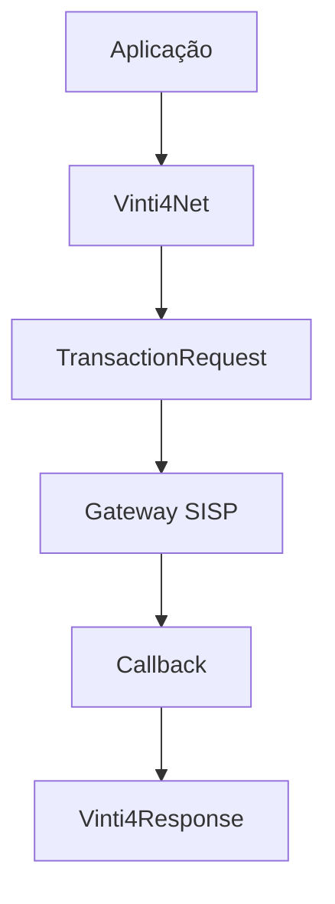

# Arquitetura

O ponto de entrada público é a facade `Vinti4Net`.

```mermaid
flowchart TD
    A[Aplicação] --> B[Vinti4Net]
    B --> C[TransactionRequest]
    C --> D[Gateway SISP]
    D --> E[Callback]
    E --> F[Vinti4Response]
```

## Componentes

| Componente | Responsabilidade |
| --- | --- |
| `Vinti4Net` | Configuração, criação de operações e processamento de respostas |
| `TransactionRequest` | Renderizar ou enviar o formulário auto-submit |
| `Billing` | Construir e normalizar dados 3DS |
| `Vinti4Response` | Expor uma resposta validada e normalizada |
| `Core\Payment` | Preparar compra, serviço e recarga |
| `Core\Refund` | Preparar reembolso |
| `Core\Sisp` | Validação e protocolo compartilhado |
| `Receipt\ReceiptRenderer` | Renderização de recibos |

Integrações devem preferir as classes públicas e não depender diretamente das classes em `Core`.
