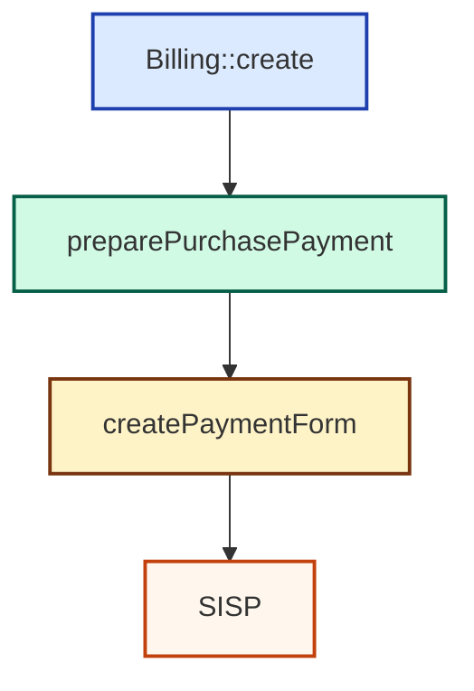

# 🧾 Billing (3DS Support)

O helper `Billing` permite **normalizar os campos de billing** necessários para o 3DS, simplificando a integração com o SDK.

---

## 🔹 Exemplo usando `Billing::create()`

```php
use Erilshk\Vinti4Net\Billing;

$billing = Billing::create([
    'email' => 'user@mail.com',
    'country' => '132',               // Código do país (CVE)
    'city' => 'Praia',
    'address' => 'Achada Santo António',
    'postalCode' => '7600',
    'mobilePhone' => '9911122',
]);
```

---

## 🔹 Exemplo usando `Billing::make()` e setters

```php
$billing = Billing::make()
    ->email('user@mail.com')
    ->country('132')
    ->city('Praia')
    ->address('Achada Santo António')
    ->postalCode('7600')
    ->mobilePhone('9911122')
    ->toArray();
```

> 💡 **Nota:**  
> `make()` permite **encadear métodos** e ajustar apenas os campos desejados antes de gerar o array final com `toArray()`.  
> `create()` é um **atalho rápido** para popular todos os campos de uma vez.

---

## 🔹 Fluxo de Billing


