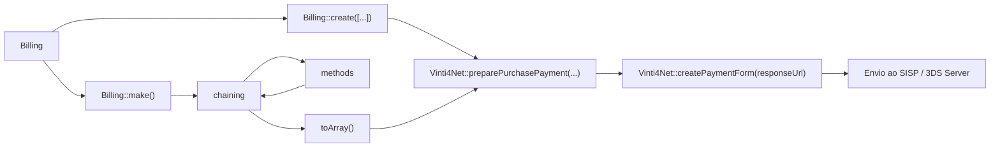

# 🧾 Billing (3DS Support)

O helper `Billing` permite **normalizar os campos de billing** necessários para compras 3DS, simplificando a integração com o SDK **Vinti4Net / SISP**.

Ele cobre:

* Campos obrigatórios de endereço (`billAddr*`, `email`)
* Endereço de entrega (`shipAddr*`)
* Telefones (`mobilePhone`, `workPhone`)
* Dados da conta do usuário (`acctID`, `acctInfo`)
* Flags de segurança (`suspicious`, `addrMatch`)

---

## 🔹 Exemplo rápido usando `Billing::create()`

```php
use Erilshk\Vinti4Net\Billing;

$billing = Billing::create([
    'email' => 'user@mail.com',
    'country' => '132',               // Código do país (CVE)
    'city' => 'Praia',
    'address' => 'Achada Santo António',
    'postalCode' => '7600',
    'mobilePhone' => '9911122',
]);
```

> 💡 `create()` é útil quando você já tem todos os dados em um array e quer gerar rapidamente o array final para enviar ao SDK.

---

## 🔹 Exemplo completo usando `Billing::make()` com chaining

```php
$billing = Billing::make()
    ->email('user@mail.com')
    ->country('132')
    ->city('Praia')
    ->address('Achada Santo António')
    ->address2('Bloco B, Apt 10')
    ->postalCode('7600')
    ->state('01')
    ->shipAddress('Rua de Entrega, 45')
    ->shipCity('Praia')
    ->shipPostalCode('7601')
    ->mobilePhone('238', '9911122')
    ->workPhone('238', '2612345')
    ->acctID('123456')
    ->acctInfo([
        'chAccAgeInd' => '05',
        'chAccChange' => '20230101',
        'chAccDate' => '20220101',
        'chAccPwChange' => '20230201',
        'chAccPwChangeInd' => '05',
        'suspiciousAccActivity' => '01',
    ])
    ->addrMatch(true)
    ->suspicious(false)
    ->toArray();
```

> 💡 **Nota:**
> `make()` permite encadear métodos e preencher apenas os campos desejados, gerando o array final com `toArray()`.
> É ideal para **cenários dinâmicos**, como capturar dados do usuário a partir de formulários.

---

## 🔹 Campos importantes de 3DS

| Campo              | Tipo                         | Obrigatório | Descrição                                                        |
| ------------------ | ---------------------------- | ----------- | ---------------------------------------------------------------- |
| `email`            | string                       | **Sim**         | Email do titular do cartão                                       |
| `billAddrCountry`  | string (ISO 3166-1 numérico) | **Sim**         | País do endereço de cobrança                                     |
| `billAddrCity`     | string                       | **Sim**         | Cidade de cobrança                                               |
| `billAddrLine1`    | string                       | **Sim**         | Endereço principal                                               |
| `billAddrLine2/3`  | string                       | Não         | Endereços secundários                                            |
| `billAddrPostCode` | string                       | **Sim**         | Código postal                                                    |
| `billAddrState`    | string                       | Não         | Código do estado/região                                          |
| `shipAddr*`        | string                       | Não         | Endereço de entrega, opcional                                    |
| `mobilePhone`      | objeto                       | Não         | `{ cc, subscriber }`                                             |
| `workPhone`        | objeto                       | Não         | `{ cc, subscriber }`                                             |
| `acctID`           | string                       | **__Recomendado__** | ID da conta do usuário                                           |
| `acctInfo`         | objeto                       | **__Recomendado__** | Informações da conta do usuário (chAccAgeInd, chAccChange, etc.) |
| `suspicious`       | bool                         | Opcional    | Marca atividade suspeita do usuário                              |
| `addrMatch`        | string Y/N                   | Opcional    | Endereço de cobrança e entrega coincidem                         |

---

## 🔹 Fluxo de Billing com SDK



    
