# Vinti4Net PHP SDK

SDK oficial para integração com o **Gateway de Pagamentos Vinti4 / SISP (Cabo Verde)**.

Este SDK oferece:

- 🔒 Pagamentos 3DS (purchase)
- 🔄 Pagamentos de serviços (entidade + referência)
- ⚡ Recargas
- 💰 Reembolsos
- 🧾 Interpretação simplificada das respostas do SISP
- 📦 Simplificação completa da geração de formulários auto-submit

---

## 📌 Fluxo geral

```mermaid
graph LR
    style A fill:#f0f4f8,stroke:#333,stroke-width:1px
    style B fill:#dbeafe,stroke:#1e40af,stroke-width:2px
    style C fill:#d1fae5,stroke:#065f46,stroke-width:2px
    style D fill:#fff7ed,stroke:#c2410c,stroke-width:2px
    style E fill:#fef3c7,stroke:#78350f,stroke-width:2px
    style F fill:#ede9fe,stroke:#6b21a8,stroke-width:2px
    style G fill:#fef2f2,stroke:#b91c1c,stroke-width:2px
    style H fill:#e0f2fe,stroke:#0369a1,stroke-width:2px

    A["<i class='fas fa-server'></i> Seu Sistema"] --> B["<i class='fas fa-cubes'></i> Vinti4Net SDK"]
    B --> C["<i class='fas fa-file-alt'></i> Gerar Formulário POST"]
    C --> D["<i class='fas fa-network-wired'></i> SISP Middleware"]
    D --> E["<i class='fas fa-user'></i> Cliente Paga"]
    E --> F["<i class='fas fa-paper-plane'></i> SISP envia callback POST"]
    F --> G["<i class='fas fa-sync'></i> Vinti4Net::processResponse()"]
    G --> H["<i class='fas fa-receipt'></i> Vinti4Response"]
    H --> A
```

