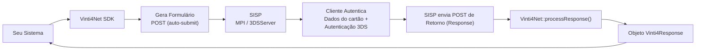

# Vinti4Net PHP SDK

SDK PHP para integração com o **Gateway de Pagamentos RedeVinti4 / SISP (Cabo Verde)**.

Este SDK oferece:

- 🔒 Pagamentos 3DS (purchase)
- 🔄 Pagamentos de serviços (entidade + referência)
- ⚡ Recargas
- 💰 Reembolsos
- 🧾 Interpretação simplificada das respostas do SISP
- 📦 Simplificação completa da geração de formulários auto-submit

---

## Composer 

```bash
# install
composer require erilshk/vinti4net
```

```php
# namespace
use Eril\Sisp\Vinti4Net; 
```

## Fluxo geral



```mermaid
graph LR

    A["Seu Sistema"] --> B["Vinti4Net SDK"]
    B --> C["Gera Formulário<br/>POST (auto-submit)"]
    C --> D["SISP<br/>MPI / 3DSServer "]
    D --> E["Cliente Autentica<br/> Dados do cartão + Autenticação 3DS"]
    E --> F["SISP envia POST de Retorno (Response)"]
    F --> G["Vinti4Net::processResponse()"]
    G --> H["Objeto Vinti4Response"]
    H --> A
```