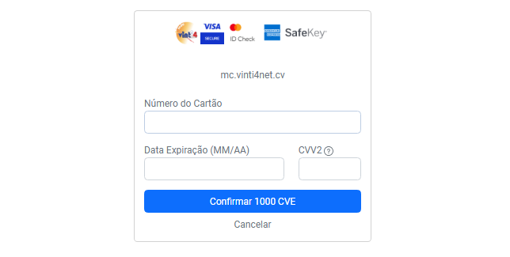
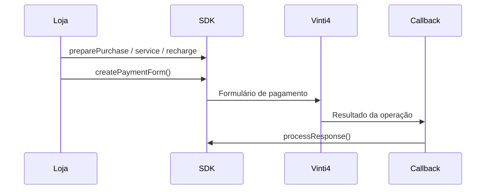

# Pagamentos

O SDK oferece três tipos de pagamento: compra, pagamento de serviço e recarga. A compra aceita dados adicionais de billing/3DS, mas também pode ser preparada sem eles.



Antes de preparar qualquer pagamento, crie o cliente e defina uma referência:

```php
use Erilshk\Sisp\Vinti4Net;

$sdk = new Vinti4Net(
    posID: $_ENV['VINTI4_POS_ID'],
    posAuthCode: $_ENV['VINTI4_AUTH_CODE'],
);
$reference = Vinti4Net::generateMerchantRef();
$sdk->setMerchant($reference);
```
Use `generateMerchantRef(random: true)` para gerar uma referência totalmente
aleatória, sem incluir a data.

`setMerchant()` também aceita uma sessão personalizada. Se ela não for informada, a biblioteca gera uma sessão no formato `S` + `ymdHis` + `##`.

---

## Purchase Payment (3DS)

Use este método para compras normais com cartão Vinti4:

```php
use Erilshk\Sisp\Billing;

$billing = Billing::from([
    'email' => 'cliente@example.cv',
    'country' => '132',
    'city' => 'Praia',
    'address' => 'Avenida Cidade de Lisboa',
    'postalCode' => '7600',
]);

$sdk->preparePurchase(
    amount: 1500,
    billing: $billing,
    currency: 'CVE',
);
```

O Billing pode ser um objeto `Billing` ou um array. Para não enviar dados de billing, use `Billing::without3DS()` ou um array vazio:

```php
$sdk->preparePurchase(1500, []);
```

Se passar dados de billing, informe os campos necessários de faturação. Consulte [Billing 3DS](billing.md).

| Parâmetro | Tipo | Obrigatório | Descrição |
| --- | --- | --- | --- |
| `amount` | `float|string` | Sim | Montante inteiro positivo, até 13 dígitos |
| `billing` | `array|Billing` | Sim, argumento explícito | Dados opcionais de billing; passe `[]` para não os enviar |
| `currency` | `string` | Não | Moeda da operação; o padrão é `CVE` `(132)` |

Embora a assinatura mantenha `float` por compatibilidade da v2, o valor precisa chegar como inteiro. Use `1500`, não `1500.00` nem `13,51`.

---

## Service Payment

Use para pagamentos associados a uma entidade e uma referência de serviço:

```php
$sdk->prepareServicePayment(
    amount: 2000,
    entity: $serviceEntityCode,
    number: '123456789',
);
```

| Parâmetro | Tipo | Descrição |
| --- | --- | --- |
| `amount` | `float|string` | Montante inteiro positivo |
| `entity` | `int` | Código numérico da entidade |
| `number` | `string` | Referência numérica com até 9 dígitos |

O código da entidade deve ser fornecido pela entidade ou pela SISP.

---

## Recharge Payment

Use para recargas associadas a uma entidade e um número de telefone ou conta:

```php
$sdk->prepareRecharge(
    amount: 500,
    entity: $rechargeEntityCode,
    number: '987654321',
);
```

Os limites de `entity` e `number` são os mesmos do pagamento de serviço.

---

## Enviar o pagamento

Depois de preparar a operação, gere o formulário que envia o cliente à página Vinti4:

```php
echo $sdk->createPaymentForm(
    responseUrl: 'https://minha-loja.cv/pagamentos/callback',
    lang: 'pt',
);
```

O método retorna uma página HTML com formulário auto-submit. Os idiomas aceitos são `pt`, `en` e `fr`.



O retorno deve ser tratado conforme descrito em [Respostas](responses.md).

