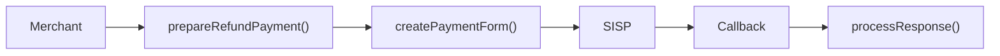

# 💸 Refunds

Para **reembolsar** uma transação existente, use o método:

```php
$vinti4->prepareRefundPayment(
    amount: 1000,                  // 💰 Valor a reembolsar
    merchantRef: "PED123",         // 🏷️ Referência original do merchant
    merchantSession: "sess-444",   // 🔑 Sessão do merchant
    transactionID: "TX119922",     // 🆔 ID da transação SISP
    clearingPeriod: "D+1"          // 📅 Período de compensação obrigatório
);
```

> ⚠️ **Nota:** O parâmetro `clearingPeriod` é obrigatório para reembolsos e deve seguir o formato definido pelo SISP (ex.: `D+1`, `D+2`).

---

## 🔹 Fluxo de Reembolso

