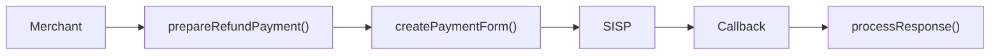

# 💸 Refunds

Para **reembolsar** uma transação existente, use o método:

```php
$vinti4->prepareRefund(
    amount: 1000,                  // 💰 Valor a reembolsar
    transactionID: "TX119922",     // 🆔 ID da transação SISP
    clearingPeriod: "1125"         // 📅 Período de compensação obrigatório
);
```

> ⚠️ **Nota:** guarde esses dados
> 
>  **`clearingPeriod`** é o Período Contabilístico em que a transação se realizou, e  é enviado na resposta pela SISP no pagamento `merchantRespCP`.

>  **`Transaction ID`** da transação Original, que é enviado na 
resposta pela SISP no parâmetro `merchantRespTid`.

> _juntos identificam unicamente uma transação na rede vinti4._

---

## 🔹 Fluxo de Reembolso


```mermaid
graph LR
   
    A["Merchant"] --> B["prepareRefundPayment()"]
    B --> C["createPaymentForm()"]
    C --> D["SISP"]
    D --> E["Callback"]
    E --> F["processResponse()"]
```