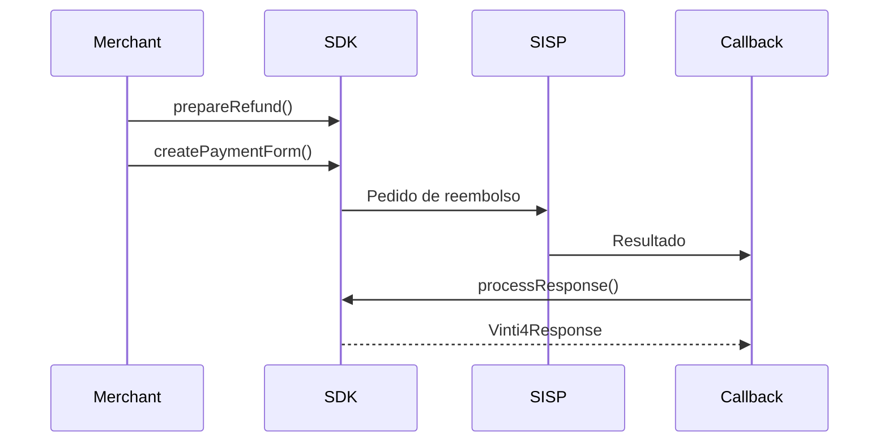

# Refunds

Use `prepareRefund()` para reembolsar uma transação existente:

```php
$vinti4->prepareRefund(
    amount: 1000,
    transactionID: 'TX119922',
    clearingPeriod: '1125',
);
```

Antes disso, defina uma referência para o reembolso e, opcionalmente, uma sessão:

```php
$vinti4->setMerchant('REFUND000000001');
```

Depois, gere o formulário:

```php
echo $vinti4->createPaymentForm(
    'https://minha-loja.cv/reembolsos/callback',
    'pt',
);
```

---

## Dados da transação original

Guarde estes dois dados quando o pagamento for aprovado:

| Dado | Campo retornado pela SISP | Método da resposta |
| --- | --- | --- |
| Clearing Period | `merchantRespCP` | `getClearingPeriod()` |
| Transaction ID | `merchantRespTid` | `getTransactionId()` |

```php
$transactionId = $response->getTransactionId();
$clearingPeriod = $response->getClearingPeriod();
```

O `clearingPeriod` é o período contabilístico no qual a transação ocorreu. O `transactionID` identifica a transação original. Juntos, eles permitem localizar a operação na rede Vinti4.

---

## Parâmetros

| Parâmetro | Tipo | Regra |
| --- | --- | --- |
| `amount` | `float|string` | Inteiro positivo, até 13 dígitos |
| `transactionID` | `string` | Até 8 caracteres alfanuméricos |
| `clearingPeriod` | `string` | Numérico, até 4 dígitos |

O reembolso usa CVE, código `132`. A biblioteca envia `transactionCode=4` e `reversal=R`.

O montante deve ser o **total da transação original**; a SISP não suporta estorno parcial neste fluxo. Guarde esse montante no seu banco e não o extraia da resposta do estorno, que pode trazer `merchantRespPurchaseAmount=0`.

---

## Fluxo de reembolso


```mermaid
sequenceDiagram
    participant Merchant
    participant SDK
    participant SISP
    participant Callback
    Merchant->>SDK: prepareRefund()
    Merchant->>SDK: createPaymentForm()
    SDK->>SISP: Pedido de reembolso
    SISP->>Callback: Resultado
    Callback->>SDK: processResponse()
    SDK-->>Callback: Vinti4Response
```

## Processar o retorno

```php
$response = $vinti4->processResponse($_POST);

if ($response->hasInvalidFingerprint()) {
    http_response_code(400);
    exit('Resposta inválida.');
}

if ($response->isSuccess()) {
    // Localize pela referência um estorno pendente, confira a sessão
    // e marque-o como concluído uma única vez.

    echo $response->renderRefundReceipt(
        amount: $originalAmount, // valor guardado para a transação original
        originalTransactionId: $originalTransactionId,
        data: ['companyName' => 'Minha Empresa'],
    );
}
```

O estorno pode retornar diretamente à URL de callback, sem apresentar uma página intermediária ao cliente. Erros `messageType=6` não revelam se eram de estorno: associe a referência recebida ao estorno pendente guardado na aplicação. Antes de reembolsar, confirme no seu banco que a transação original foi aprovada e ainda permite a devolução solicitada.
