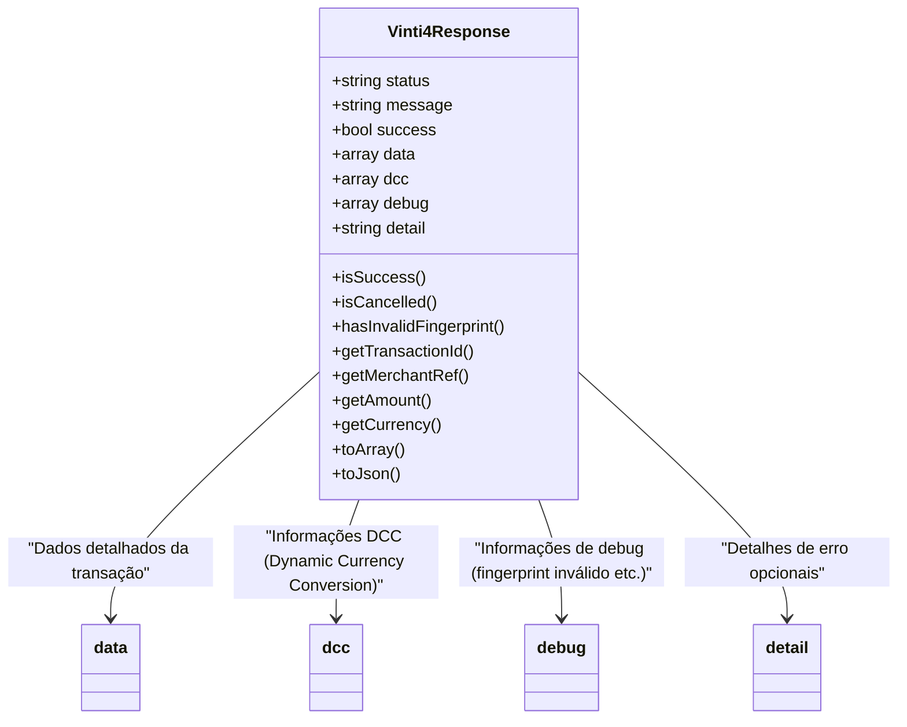

# 📦 Vinti4Response

Todas as respostas processadas pelo SDK retornam um **objeto padrão** `Vinti4Response`.  
Ele **unifica e interpreta** todas as respostas do SISP, incluindo sucesso, erros, cancelamentos e problemas de fingerprint.

---

## 🔹 Exemplo de uso

```php
$response = $sdk->processResponse($_POST);

if ($response->isSuccess()) {
    echo "Transação aprovada! ID: " . $response->getTransactionId();
} elseif ($response->isCancelled()) {
    echo "Transação cancelada pelo usuário.";
} elseif ($response->hasInvalidFingerprint()) {
    echo "Problema de segurança: fingerprint inválido.";
}

$data = $response->toArray();   // Array completo
$json = $response->toJson();   // JSON formatado
```

---

## 🔹 Principais métodos

| Método | Descrição |
|--------|-----------|
| `isSuccess()` | Retorna `true` se a transação foi concluída com sucesso. |
| `isCancelled()` | Retorna `true` se o usuário cancelou a transação. |
| `hasInvalidFingerprint()` | Retorna `true` se houve problema de fingerprint. |
| `getTransactionId()` | Retorna o ID da transação no SISP, se disponível. |
| `getMerchantRef()` | Retorna a referência do merchant. |
| `getAmount()` | Retorna o valor da transação. |
| `getCurrency()` | Retorna a moeda da transação. |
| `toArray()` | Retorna todos os dados da resposta como array. |
| `toJson()` | Retorna todos os dados da resposta como JSON formatado. |

---

## 🔹 Estrutura do objeto



---

### 🔹 Observações importantes

1. `status` pode ser: `SUCCESS`, `CANCELLED`, `INVALID_FINGERPRINT` ou `ERROR`.  
2. `dcc` contém informações sobre **Dynamic Currency Conversion**, se aplicável.  
3. `debug` ajuda a identificar problemas de segurança (fingerprint).  
4. `detail` fornece **informações detalhadas de erro** retornadas pelo SISP.  
