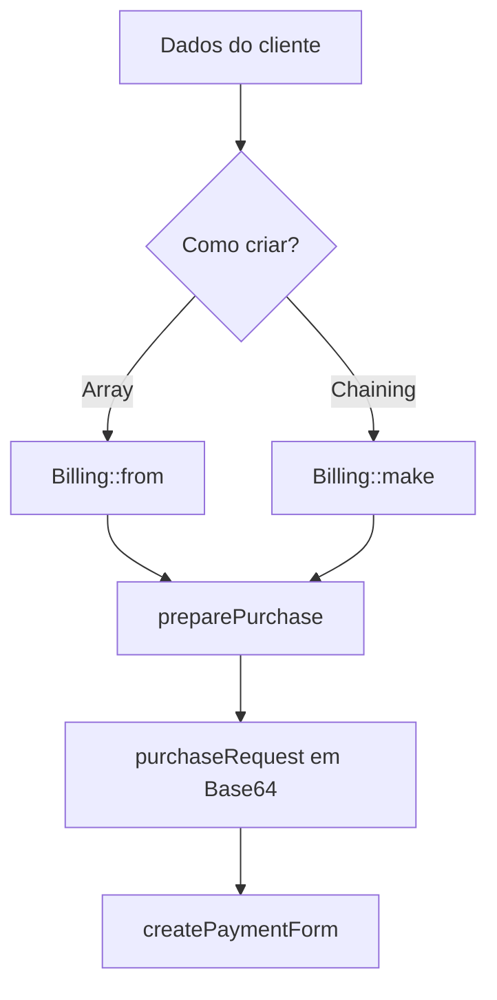

# Billing (3DS Support)

O helper `Billing` normaliza os dados necessários para compras 3DS e evita que a aplicação monte manualmente a estrutura esperada pela SISP.

Ele cobre:

- campos obrigatórios de faturação;
- endereço de entrega;
- telefones;
- identificação e histórico da conta;
- indicação de atividade suspeita;
- correspondência entre endereço de faturação e entrega.

---

## Exemplo rápido com `Billing::from()`

Use `from()` quando os dados já estão num array:

```php
use Erilshk\Sisp\Billing;

$billing = Billing::from([
    'email' => 'user@mail.com',
    'country' => '132',
    'city' => 'Praia',
    'address' => 'Achada Santo António',
    'postalCode' => '7600',
    'mobilePhone' => '9911122',
]);
```

O objeto pode ser enviado diretamente:

```php
$vinti4->preparePurchase(1500, $billing);
```

Para obter o array normalizado:

```php
$data = $billing->toArray();
```

`Billing::create()` continua disponível na v2.2, mas está deprecated. O substituto é:

```php
$data = Billing::from($dados)->toArray();
```

---

## Exemplo completo com chaining

```php
$billing = Billing::make()
    ->email('user@mail.com')
    ->country('132')
    ->city('Praia')
    ->address('Achada Santo António')
    ->address2('Bloco B, Apt 10')
    ->address3('Próximo ao mercado')
    ->postalCode('7600')
    ->state('01')
    ->shipCountry('132')
    ->shipAddress('Rua de Entrega, 45')
    ->shipCity('Praia')
    ->shipPostalCode('7601')
    ->shipState('01')
    ->mobilePhone('238', '9911122')
    ->workPhone('238', '2612345')
    ->accountId('123456')
    ->accountInfo([
        'chAccAgeInd' => '05',
        'chAccChange' => '20230101',
        'chAccDate' => '20220101',
        'chAccPwChange' => '20230201',
        'chAccPwChangeInd' => '05',
        'suspiciousAccActivity' => '01',
    ])
    ->addressMatchesShipping(false)
    ->suspicious(false);
```

`make()` é indicado quando os dados são adicionados de forma gradual. `toArray()` remove campos vazios.

---

## Campos obrigatórios

| Campo SISP | Nome amigável | Tipo | Descrição |
| --- | --- | --- | --- |
| `email` | `email` | `string` | E-mail do titular |
| `billAddrCountry` | `country` | `string` | País em código numérico, como `132` |
| `billAddrCity` | `city` | `string` | Cidade de faturação |
| `billAddrLine1` | `address` | `string` | Endereço principal |
| `billAddrPostCode` | `postalCode` | `string` | Código postal |

Se algum deles estiver vazio, `preparePurchase()` falha ao gerar o `purchaseRequest`.

## Campos opcionais de faturação

| Campo SISP | Nome amigável | Método |
| --- | --- | --- |
| `billAddrLine2` | `address2` | `address2()` |
| `billAddrLine3` | `address3` | `address3()` |
| `billAddrState` | `state` | `state()` |

## Endereço de entrega

| Campo SISP | Nome amigável | Método |
| --- | --- | --- |
| `shipAddrCountry` | `shipCountry` | `shipCountry()` |
| `shipAddrCity` | `shipCity` | `shipCity()` |
| `shipAddrLine1` | `shipAddress` | `shipAddress()` |
| `shipAddrPostCode` | `shipPostalCode` | `shipPostalCode()` |
| `shipAddrState` | `shipState` | `shipState()` |

Use `addressMatchesShipping(true)` quando o endereço de entrega corresponde ao endereço de faturação. O valor enviado será `Y`; para `false`, será `N`.

---

## Telefones

```php
$billing
    ->mobilePhone('238', '9911122')
    ->workPhone('238', '2612345');
```

A estrutura final é:

```php
[
    'cc' => '238',
    'subscriber' => '9911122',
]
```

Ao usar `Billing::from()`, também pode passar apenas o número. Nesse caso, a biblioteca usa `238` como código padrão.

---

## Dados da conta

### `acctID`

Identifica a conta do cliente no sistema do comerciante:

```php
$billing->accountId('CLIENTE-123');
```

O limite validado pela requisição é 64 caracteres.

### `acctInfo`

```php
$billing->accountInfo([
    'chAccAgeInd' => '05',
    'chAccDate' => '20220101',
    'chAccChange' => '20230101',
    'chAccPwChange' => '20230201',
    'chAccPwChangeInd' => '05',
]);
```

Quando não informados, `chAccAgeInd`, `chAccPwChangeInd` e `suspiciousAccActivity` recebem valores padrão.

### Atividade suspeita

```php
$billing->suspicious(true);
```

`true` define `suspiciousAccActivity` como `02`; `false` define como `01`.

---

## Nomes amigáveis e nomes SISP

`Billing::from()` aceita os dois formatos:

```php
Billing::from([
    'country' => '132',
    'billAddrCity' => 'Praia',
    'address' => 'Plateau',
    'billAddrPostCode' => '7600',
    'email' => 'user@mail.com',
]);
```

Campos desconhecidos são ignorados para manter compatibilidade com a linha v2.

---

## Métodos deprecated na v2.2

| Método antigo | Substituto |
| --- | --- |
| `Billing::create()` | `Billing::from(...)->toArray()` |
| `addrMatch()` | `addressMatchesShipping()` |
| `acctID()` | `accountId()` |
| `acctInfo()` | `accountInfo()` |
| `fromUser()` | Mapeamento explícito com `Billing::from()` |

Eles continuam funcionais na v2.2 e podem ser migrados gradualmente.

---

## Fluxo do Billing



